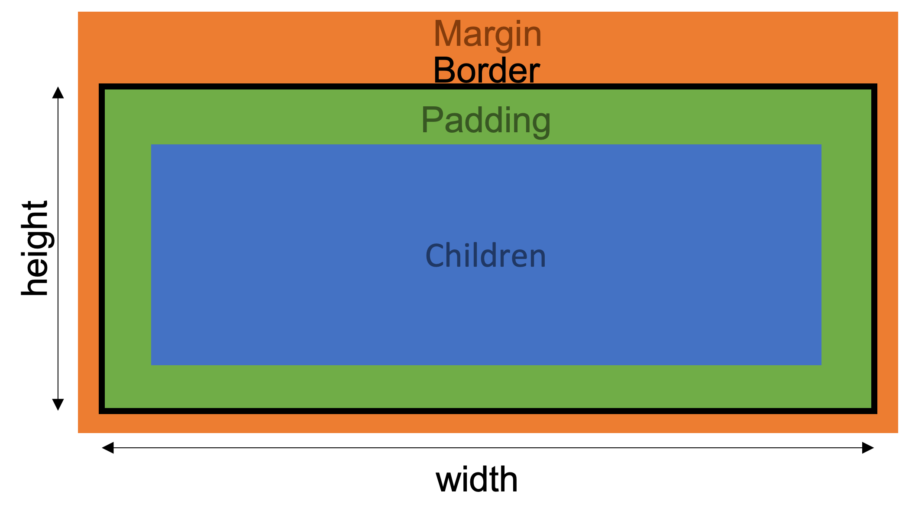
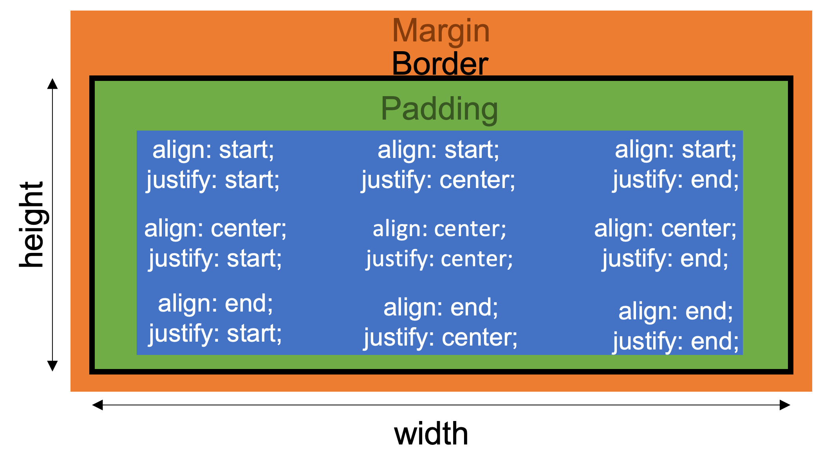
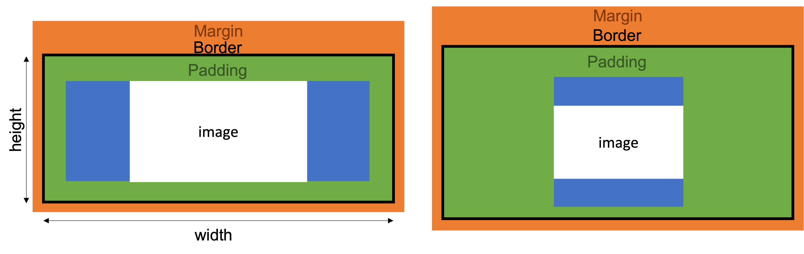

# Classes

This page describes the functionality of classes used in the pywind library.

## pywind.Element

The most basic element class.

The Element class inherits from the `pygame.sprite.Sprite` class. It computes an image and a rect based on its style component and its prescribed position by its parent. It contains a group of child elements which it prescribes positions based on its style attributes and renders to its image surface.

## pywind.Container

Inherits from [pywind.Element](#pywind.Element).

`Container` is used as the root element of a tree of elements and is designed to be drawn directly to the display surface. It has some default attributes which child elements will inherit by default such as `font` and `font-size`.

For this reason, its default positioning is `absolute` and its **default parent** is the **current pygame display surface** (updated on `update()`).

Default style overides:

Attribute | Value
--- | ---
`position` | `absolute`
`parent` | `{ pygame.display.get_surface() }`
`font` | `{ pygame.font.get_default_font().split(".")[0] }`
`font-size` | `12px`
`text-colour` | `black`

## pywind.Text

Inherits from [pywind.Element](#pywind.Element).

The `Text` element renders just text to its image surface. It does not support adding children, instead the first 'child' should be a string that will be used for the text rendering.

The `Text` element repurposes the [`align`](styling.md#align--align-items) and [`justify`](styling.md#justify--justify-content) attributes as text alignment attributes. `justify` refers to horizontal text alignment and `align` refers to vertical text alignment (see image for reference).

## pywind.Image

Inherits from [pywind.Element](#pywind.Element).

The `Image` element renders an image to its image surface. It does not support adding children, instead the first 'child' should be a string representing the path to the image.

The image will be scaled to fit the size of the element without stretching.

## pywind.Button

Inherits from [pywind.Element](#pywind.Element).

The `Button` element supports click detection and calls a given function or series of function when clicked. It also overides some styling by default to make it look like a button. If the button's only child is a string, a `pywind.Text` element will be created and added as a child.

**Note:** Due to the way click detection is handled, all buttons that intersect the cursor will be activated, not just the one on top. For that reason, in most cases, a button should not be a child of another button.

Default style overrides:

Attribute | Value
--- | ---
`border-width` | `1px`
`border-radius` | `5px`
`hover: background-colour` | `grey85`
`hover: border-colour` | `grey60`
`hover: text-colour` | `grey15`
`active: background-colour` | `grey60`
`active: border-colour` | `grey30`
`active: text-colour` | `grey15`
`cursor` | `{pygame.SYSTEM_CURSOR_HAND}`

## pywind.Style

The `Style` class contains layout and [styling options](styling.md) for an element. It sizes, colours, fonts etc.

It is given a style-string that is computed into various styling attributes.
