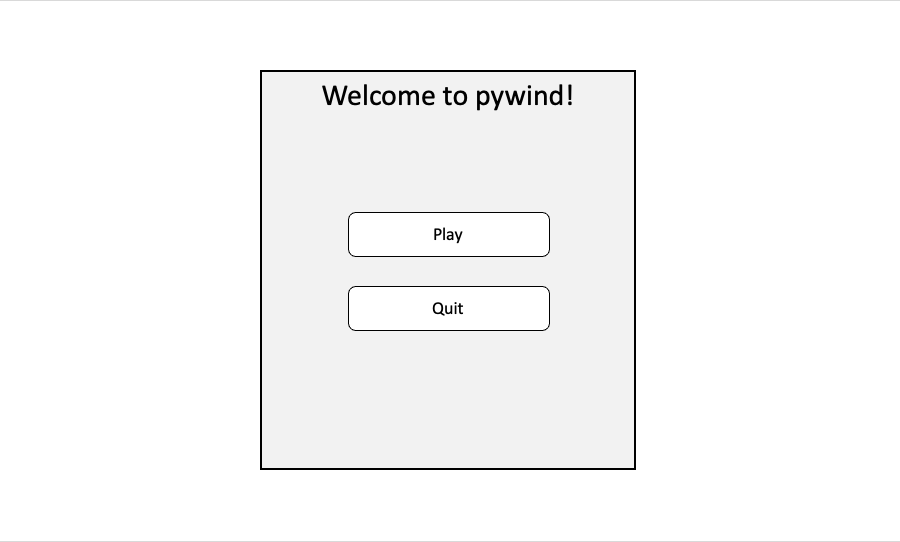

# Directory

## About

pywind is a multi-purpose UI solution for pygame projects. Elements are structured similarly to HTML, and styling strings inspired by TailwindCSS make styling and laying out UI elements intuitive and powerful.

----

See the below links to get started:

* [Quick Start](#quick-start)
* [Classes](classes.md)
* [Styling](styling.md)
* [Methods](methods.md)

## Quick Start

```python
import pygame as pg
import pywind as pw

WIN = pg.display.set_mode((800, 600), pg.RESIZABLE)

splashmenu = pw.Container(
    # Create a column Container that is centered in the screen with a border of 2px and whose elements will be justified to the center.
    style="background-colour: gray91; pos-center: 50% 50%; width: 35%; height: 80%; border: 2px; direction: column; justify: center;",
    children=[
        # Create a heading which sits absolutley at the top of the container
        pw.Text(
            style="positioning: absolute; pos-midtop: 50% 5px; font-size: 30px;",
            text="Welcome to pywind!"
        )
        # Create two buttons with vertical margins of 2% each.
        pw.Button(
            style="width: 60%; height: 10%; margin: 0% 2%;",
            text="Play",
            onclick=lambda: print("Play")
        ),
        pw.Button(
            style="width: 60%; height: 10%; margin: 0% 2%;",
            children="Quit",
            onclick=lambda: print("Quit")
        ),
    ]
)

running = True
while running:
    # Run pywind.tick() once per frame before the event queue is cleared.
    pw.tick()

    for event in pg.event.get():
        if event.type == pg.QUIT:
            running = False
    
    WIN.fill((255, 255, 255))
    
    splashmenu.update()
    splashmenu.draw(WIN)

    pg.display.update()
```

You can create a simple UI with just a few lines of code.



This menu has a heading, two buttons, and a container that is centered in the screen. The buttons have dynamic hover and click states and each call a function on being clicked. Additionally, the screen can be resized and the UI elements will adjust automatically based on the percentages provided in the style strings. This was acheived in just 23 lines of pywind code and 9 lines of pygame boiler-plate code.
